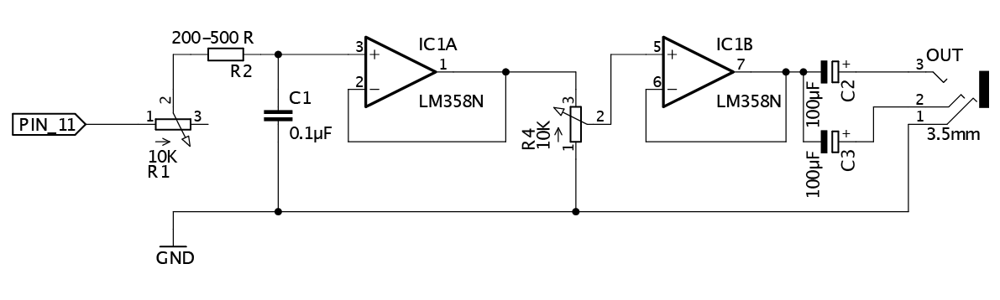
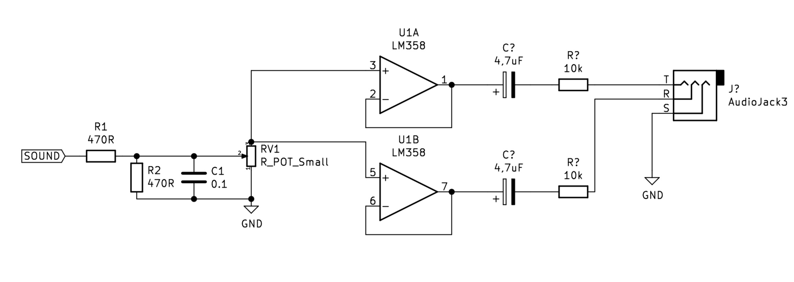

# Sound and Sensor
 
### Sensors
 - Lichtsensor (LDR)
 - Potentiometer / Fader
 - Button
 - Gewicht (load cell)
 - Kapazitiv (touch sensor)
 - Halleffektsensor (Magnetfeld)
 - Distanz (Ultraschall, LIDAR, TOFL, Infrarot)
 - Temperatur (NTC)
 - Vibrationssensor
 - Neigungssensor / Gyroskopsensor
 - Feuchtigkeit
 - CO2 Sensor / Luftqualität / Staub
 - Bewegung PIR 
 - Sound -> Mikrofon 
 - EEG -> Hirnwellen
 

### digital sound synthesis
[Fundamentals of DDS](https://www.analog.com/media/en/training-seminars/tutorials/MT-085.pdf)  
[sound with microcontrollers - basics](https://docs.google.com/presentation/d/1hkkO9E6nDX2Fc8-_3xpN_fOWZSlyRCr3UhbPVnf_sVU/edit?usp=sharing)

### byte beat and bit math
[bit math explained](https://playground.arduino.cc/Code/BitMath/)  
[byte beat in the browser](https://wurstcaptures.untergrund.net/music/)  
[byte beat godfather viznut](http://viznut.fi/en/)

### electronics basics
[breadboard](https://computers.tutsplus.com/tutorials/how-to-use-a-breadboard-and-build-a-led-circuit--mac-54746)

### CH340 Driver
[MAC](https://github.com/adrianmihalko/ch340g-ch34g-ch34x-mac-os-x-driver)  
[WIN](http://www.wch.cn/download/CH341SER_ZIP.html)
### circuits

